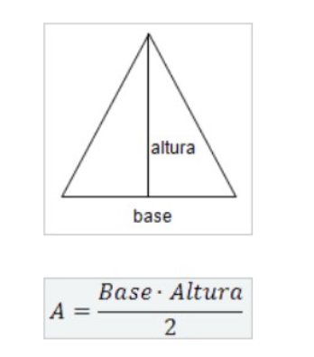
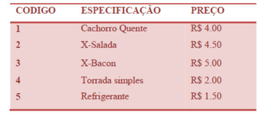
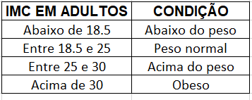

### Esse documento tem como objetivo ajudar os alunos a desenvolverem melhor sua lógica! 

### Vamos nessa?

## Exercícios Nivel 1 - Estruturas de condição e repetição

1. Leia 2 valores reais N1 e N2, que correspondem a 2 notas de um aluno. A seguir, calcule a média do aluno, sabendo que a nota N1 tem peso 3.5 e a nota N2 tem peso 7.5 (A soma dos pesos, portanto é  11). Assuma que cada nota pode ir de 0 até 10.0. 

* **Exemplo de Entrada**
`5
10`
* **Exemplo de Saída**
`O número 10 é maior`

2. Escreva um algoritmo para ler as dimensões de um triângulo  (base e altura). Sabendo que para calcular a área devemos usar a  fórmula a seguir: 

3. Leia 2 valores reais N1 e N2, que correspondem a 2 notas de um aluno. A seguir, calcule a média do aluno, sabendo que a nota N1 tem peso 3.5 e a nota N2 tem peso 7.5 (A soma dos pesos, portanto é  11). Assuma que cada nota pode ir de 0 até 10.0.
* **Exemplo de Entrada**
`5.0
7.1`
* **Exemplo de Saída**
`6.43`

4. Escreva um programa que leia o número de um funcionário, seu número de horas trabalhadas, o valor que recebe por hora e calcule o salário desse funcionário. A seguir, mostre o número e o salário do funcionário.
* **Exemplo de Entrada**
`25
100
5.50`
* **Exemplo de Saída**
`Número de funcionário: 25
Salário: R$ 550`

5. Escreva um programa que leia quantos anos o usuário tem. Você precisa solicitar o ano de nascimento e o ano atual para o usuário
* **Exemplo de Entrada**
`2022
1995`
* **Exemplo de Saída**
`Você tem 27 anos`

6.Leia o ano que uma pessoa nasceu e verifique se o voto dessa pessoa é opcional ou obrigatório se ela tiver a idade maior ou igual a 18 e a idade menor ou igual a 70 é obrigatório votar se não é voto opcional
* **Exemplo de Entrada**
`1995`
* **Exemplo de Saída**
`Você tem 27 anos você pode votar`

7. Leia 4 valores inteiros A, B, C e D. A seguir, se B for maior do que C e se D for maior do que A, e a soma de C com D for maior que a soma de A e B e se C e D, ambos, forem positivos escrever a mensagem "Valores aceitos", senão escrever "Valores não aceitos"
* **Exemplo de Entrada**
`1, 8, 7,  10`
* **Exemplo de Saída**
`Valores aceitos`

8.Joaozinho quer calcular e mostrar a quantidade de litros de combustível gastos em uma viagem, ao utilizar um automóvel que faz 12 KM/L. Para isso, ele gostaria que você o auxiliasse através de um simples programa. Para efetuar o cálculo, deve-se fornecer o tempo gasto na viagem (em horas) e a velocidade média durante a mesma (em km/h). Assim, pode-se obter distância percorrida e, em seguida, calcular quantos litros seriam necessários. Mostre o valor com 3 casas decimais após o ponto.

* **Exemplo de Entrada**
`10
85`
* **Exemplo de Saída**
`70.833`

9.Com base na tabela abaixo, escreva um programa que leia o código de um item e a quantidade deste item. A seguir, calcule e mostre o valor da conta a pagar.

* **Exemplo de Entrada**
`3 
2`
* **Exemplo de Saída**
`Total: R$ 10.00`

10. A fórmula para calcular a área de uma circunferência é: area = π . raio2. Considerando para este problema que π = 3.14159:

- Efetue o cálculo da área, elevando o valor de raio ao quadrado e multiplicando por π.

* **Exemplo de Entrada**
`2.00`
* **Exemplo de Saída**
`A=12.5664`

11.IMC – Índice de Massa Corporal é um critério da Organização Mundial de Saúde para dar uma indicação sobre a condição de peso de uma pessoa adulta. 
A fórmula é IMC = peso/( altura*altura) Elabore um algoritmo que leia o peso e a altura de um adulto e mostre sua condição de acordo com a tabela abaixo. 

12.Elabore um programa que conte de 0 até quanto o usuário quiser

* **Exemplo de Entrada**
`6`
* **Exemplo de Saída**
`0 1 2 3 4 5 6`

12.Elabore um programa que conte de 0 até quanto o usuário quiser com saltos

* **Exemplo de Entrada**
`10
2`
* **Exemplo de Saída**
`0 2 4 6 7 10`

13.Escrever um programa que leia 10 números inteiros e, ao final, apresente a soma de todos os números lidos
* **Exemplo de Entrada**
`2 3 4 5 7 8 9 10 1 3`
* **Exemplo de Saída**
`52`

14. Este exercício é apenas um desafio de lógica.  Escreva um algoritmo que armazene o valor 10 em uma variável A e o valor 20 em uma variável B.  A seguir (utilizando apenas atribuições entre variáveis) troque os seus conteúdos fazendo com que o valor que está em A passe para B e vice-versa. Ao final, escrever os valores que ficaram armazenados nas variáveis
* **Exemplo de Entrada**
`Digite um valor para A: 30`
`Digite um valor para B: 40`
* **Exemplo de Saída**
`Se invertermos a ordem A:40 e B:30`

15.Crie um programa para verificar se uma pessoa pode ou não doar sangue. Se a idade for maior ou igual a 18 anos e a pessoa pesar mais de 50kg, ela poderá doar sangue, caso contrário, não poderá doar sangue
* **Exemplo de Entrada**
`idade: 27
peso: 53`
* **Exemplo de Saída**
`Você pode doar sangue`

> Nunca fica mais fácil, você apenas fica melhor!

## Exercícios Nível 1.2 - Funções

1. Faça uma função que converta centímetros para metros

2. Faça uma função que converta real para dólar

3. aça uma função que receba dois números e mostre o maior deles

4. Faça uma função que converta temperatura de Fahrenheit para Celsius 

## Exercícios Nivel 1.3 - Funções

Neste exercício, vamos criar um programa de bordo para nossa nave que receba o nome da nave
A velocidade da nave deve ser inicialmente 0 e um menu deve ser exibido para que o usuário escolha entre as seguintes opções: 
1. Acelerar a nave em 5km/s
2. Desacelerar a nave em 5km/s
3. Imprimir dados de bordo
4. Sair do programa

Caso a pessoa escolha um número que não está na lista é necessário exibir o menu novamente até que seja escolhida uma opção válida. Para fazer esse app precisaremos: 
Criar uma função que exiba o menu e valide a opção escolhida
Uma função para cada ação do menu de acelerar, desacelerar e imprimir dados de bordo

**Lembre-se: existem várias formas de fazer esse exercício,utilize estrutura de repetições, if else e funções**
